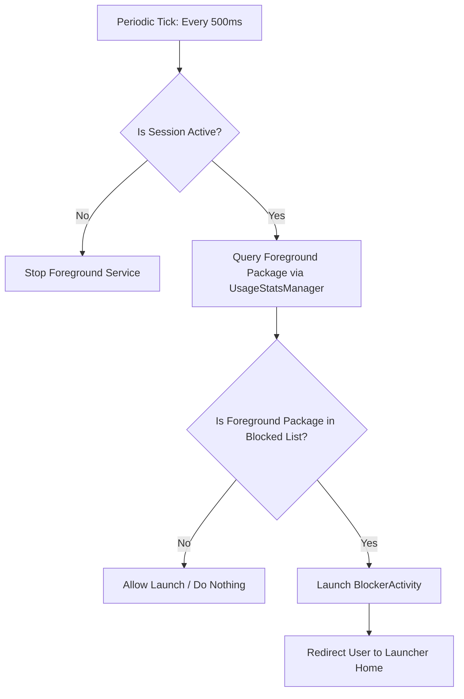

> [!IMPORTANT]
> **Developer Sync Note**: To maintain continuity across multiple chat sessions, you MUST update this document after every backend shift, API adjustments, storage updates, or permission modifications.

# App Backend & Architecture

The background layer coordinates app scanning, session timers, and real-time window tracking to intercept restricted packages.

## 1. System Interception Flow



1. **Foreground Polling Service**: `AppBlockerForegroundService` runs a background coroutine loop that queries the active foreground application package name using the `UsageStatsManager` API every 500ms when a focus session is active.
2. **Session Verification**: The `BlockedAppsManager` check determines if a lock session is currently active and the current epoch time is less than `sessionEndTimeMillis`.
3. **Redirection Action**: If a blocked package is detected in the foreground, we launch `BlockerActivity` with:
   ```kotlin
   flags = Intent.FLAG_ACTIVITY_NEW_TASK or Intent.FLAG_ACTIVITY_CLEAR_TASK
   ```
   `BlockerActivity` acts as a persistent blocker overlay and redirects back-presses or click events to the launcher home intent (`Intent.CATEGORY_HOME`) to keep the user focused.

## 2. Storage & State Persistence

`BlockedAppsManager` uses `SharedPreferences` to manage state across app kills:
- **Key `blocked_packages`**: Set of strings containing the package IDs (e.g. `com.instagram.android`).
- **Key `session_end_time`**: Long integer representing the time in milliseconds since epoch when the block expires. Set to `0` or a past value when no session is active.
- **Key `session_duration_total`**: Long representing the duration of the current session in milliseconds.

## 3. Package Query Configuration

Due to Android 11+ restrictions, we declare package querying capabilities:
- **Queries Manifest Block**: Instead of requesting the high-risk, policy-flagged `QUERY_ALL_PACKAGES` permission, we use a targeted `<queries>` intent block matching launcher activities.
- **Retrieval**: `packageManager.getInstalledPackages(0)` is used to list user-installed launcher apps. On Android 11+, the OS automatically filters this list to only return apps matching our launcher intent queries, ensuring privacy-compliant package retrieval.

## 4. Focus Insights & Distraction Statistics

To support premium data visualizations and focus scoring, the background layer tracks focus session efficiency metrics:

- **Weekly Focus Duration**: Tracks active focus time (in milliseconds) per day. For every 500ms service tick, if a session is active and the foreground app is not blocked and not the launcher, we increment the daily focus duration.
- **Apps Blocked Counts**: Tracks the number of times a user attempted to access blocked apps during active focus sessions.
- **Rapid App-Switching (Distraction Score)**: Tracks instances where the user switches between different applications (excluding launcher home or blocker activity) in under 10 seconds. This indicates restlessness and increments the distraction count.
- **Reactive Repository**: `StatsRepository` exposes these daily metrics through a reactive flow (`weeklyStatsFlow`) tied to `OnSharedPreferenceChangeListener`, ensuring live UI updates.
- **Distraction Score Formula**:
  $$Score = (BlockedAttempts \times 5) + (RapidSwitches \times 2)$$
