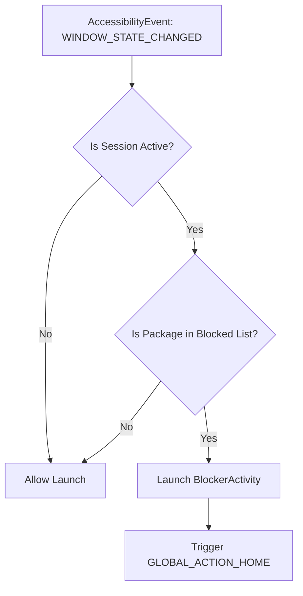

> [!IMPORTANT]
> **Developer Sync Note**: To maintain continuity across multiple chat sessions, you MUST update this document after every backend shift, API adjustments, storage updates, or permission modifications.

# App Backend & Architecture

The background layer coordinates app scanning, session timers, and real-time window tracking to intercept restricted packages.

## 1. System Interception Flow



1. **Accessibility Event**: We listen exclusively to `AccessibilityEvent.TYPE_WINDOW_STATE_CHANGED` which triggers when a new package window comes to focus.
2. **Session Verification**: The `BlockedAppsManager` check determines if a lock session is currently active and the current epoch time is less than `sessionEndTimeMillis`.
3. **Redirection Action**: If both are true, we start `BlockerActivity` with:
   ```kotlin
   flags = Intent.FLAG_ACTIVITY_NEW_TASK or Intent.FLAG_ACTIVITY_CLEAR_TASK
   ```
   and immediately execute `performGlobalAction(GLOBAL_ACTION_HOME)` to force the underlying target app to collapse.

## 2. Storage & State Persistence

`BlockedAppsManager` uses `SharedPreferences` to manage state across app kills:
- **Key `blocked_packages`**: Set of strings containing the package IDs (e.g. `com.instagram.android`).
- **Key `session_end_time`**: Long integer representing the time in milliseconds since epoch when the block expires. Set to `0` or a past value when no session is active.
- **Key `session_duration_total`**: Long representing the duration of the current session in milliseconds.

## 3. Package Query Configuration

Due to Android 11+ restrictions, we declare package querying capabilities:
- **Permission**: `android.permission.QUERY_ALL_PACKAGES`
- **Retrieval**: `packageManager.getInstalledApplications(PackageManager.GET_META_DATA)` or `getInstalledPackages(0)` is used to list user-installed launcher apps, filtering out critical system packages (e.g. system UI, settings) to avoid blocking essential phone functions.
